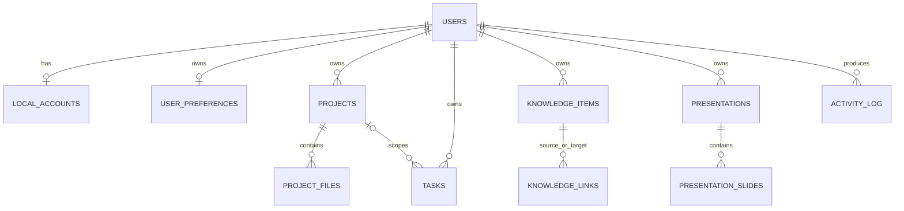

# الجرد الهندسي الحالي لـOsamah IDE

## حدود الجرد

يغطي هذا الجرد كود التطبيق المملوك داخل `client/` و`server/` و`drizzle/` و`shared/`، ولا يعامل لقطات المصدر في `third_party/` بوصفها كوداً قابلاً للتحرير. تضم طبقة الخلفية المخصصة **2,711 سطراً** من TypeScript تقريباً، وتضم طبقة العميل المخصصة خارج مكوّنات الواجهة الجاهزة **4,849 سطراً** تقريباً. هذه أرقام جرد وليست مقياس جودة بحد ذاتها.

| الطبقة | الوحدات الفعلية | المسؤولية | حالة الفصل الحالية |
|---|---|---|---|
| نقطة التشغيل | `server/_core/index.ts`، `client/src/main.tsx` | تشغيل Express/Vite، ومزوّدات React وtRPC | طبقة الإطار؛ لا تعدّل إلا لحاجة بنيوية واضحة. |
| تجميع العقود | `server/routers.ts` | يركب وحدات tRPC ويحتوي مسار الحساب المحلي العام | جيد إجمالاً، لكنه أكبر من كونه تجميعاً خالصاً بسبب منطق الحساب المحلي. |
| الهوية | `server/localAuth.ts`، `server/db.ts`، `AuthGate.tsx` | تجزئة scrypt، جلسة JWT في Cookie، حسابات محلية ومفاتيح محطة | منطق حساس يحتاج توثيقاً واختبارات إساءة الاستخدام ومعدلات طلبات. |
| مساحة البرمجة | `server/workspace/{router,db,access}.ts` | المشاريع والملفات والمهام وسجل النشاط والملكية | CRUD واقعي ومحمي، لكن خدمة `db.ts` تجمع الاستعلامات والملكية وسجل النشاط في ملف واحد. |
| العروض | `server/presentations/{router,db}.ts`، `server/presenton/*` | العروض والشرائح وحالة جسر Presenton | CRUD مستقل؛ التكامل الفعلي للصحة فقط ولا يوجد توليد/تصدير مفعّل. |
| العقل الثاني | `server/secondbrain/{router,db,extract}.ts` | عناصر المعرفة والروابط والبحث واستخراج المهام | CRUD واقعي؛ المكوّنات الاختيارية الأخرى غير مشغلة. |
| المحركات | `server/{opencode,theia,presenton,engines}/*` | تكييف المصادر، الصحة، السياق وحالة الجاهزية | الحدود صريحة؛ لا توجد نماذج OpenCode ولا Theia مبني ولا مزوّد Presenton للتوليد. |
| البيانات | `drizzle/schema.ts`، وحدات `db.ts` | Drizzle/MySQL وهجرات مخطط التطبيق | قيود الملكية والفهارس الأساسية موجودة؛ محتوى الملف والنصوص الكبيرة يحتاجان سياسات حجم واحتفاظ. |
| الواجهة | `OsamahWorkspace.tsx`، `PresentationStudio.tsx`، `ServerSettingsView.tsx` | سطح مكتب عمودي، RTL/LTR، المظهرين وعمليات CRUD | ملف مساحة العمل كبير نسبياً؛ المعاينة المؤقتة مقيدة عمداً وليست جلسة استخدام حقيقية. |

## الكيانات والعلاقات المثبتة من المخطط

| الكيان | المعرّف والملكية | قواعد مهمة |
|---|---|---|
| `users` و`localAccounts` | المستخدم مفتاح بديل رقمي؛ حساب محلي واحد لكل مستخدم | `accountKey` فريد وغير سري، بينما كلمات المرور وإجابات الاسترداد مجزأة. |
| `projects` و`projectFiles` | المشروع مملوك للمستخدم؛ الملف يتبع مشروعاً | فهرس فريد على `projectId + path`، و`parentId` يحتاج تحققاً خدمياً لكونه مجلداً من المشروع نفسه. |
| `tasks` و`activityLog` | كلاهما مملوك مباشرة للمستخدم | ربط المهمة بالمشروع اختياري؛ أحداث النشاط تحفظ JSON نصياً. |
| `knowledgeItems` و`knowledgeLinks` | كلاهما مملوك للمستخدم | الرابط مميز بـ`ownerId + fromItemId + toItemId`. |
| `presentations` و`presentationSlides` | العرض مملوك للمستخدم والشرائح تابعة له | موضع الشريحة فريد داخل العرض. |

## خريطة العقود وحدود الحماية

| العقد | الحماية | الغرض | ملاحظة تدقيقية |
|---|---|---|---|
| `auth.local.*` | إجراء عام مع تحقق بيانات/جلسة | إنشاء، دخول، استرداد وتحديث ملف محلي | التسجيل والاسترداد إجراءات حساسة؛ لا يظهر في العقد نفسه ضبط معدل محاولات أو تأخير موحد. |
| `workspace.*` | `protectedProcedure` | CRUD وعزل الملكية للمشاريع والملفات والمهام | اختبارات العزل الطرفية موجودة. |
| `presentations.*` و`secondBrain.*` | `protectedProcedure` | CRUD وعزل ملكية العروض والمعرفة | اختبارات العزل الطرفية تغطي النطاقين. |
| `engines.*` و`opencode.*` | محمي عند الوصول إلى السياق أو الجلسات | إعلان الجاهزية وتجهيز سياق خادمي | الإرسال مقفل بصدق عند غياب مزوّد/نموذج حقيقي. |

## ملاحظات معمارية أولية قابلة للتحقق

> هذه النتائج هي فرضيات تدقيق مبنية على الكود المقروء، وليست اتهاماً بأن الوظيفة لا تعمل.

| المعرف | الملاحظة | الأثر المحتمل | أولوية المراجعة |
|---|---|---|---|
| ARC-01 | `server/workspace/db.ts` يجمع الملكية وCRUD وسجل النشاط. | تضخم الخدمة وصعوبة إعادة استخدام سجل النشاط بعيداً عن مساحة العمل. | مرتفع |
| ARC-02 | `secondbrain/db.ts` و`presentations/db.ts` يعتمدان على `writeActivity` من وحدة مساحة العمل. | اقتران بين نطاقات مستقلة؛ الأنسب نقل نشاط التدقيق إلى خدمة مستقلة. | مرتفع |
| ARC-03 | حقلا البريد في `users` و`localAccounts` يتكرران عند وجوده. | خطر اختلاف القيم إن تغيرت مسارات التحديث مستقبلاً. | متوسط |
| ARC-04 | محتوى الملفات وملاحظات المعرفة والشرائح محفوظة كنصوص كبيرة في قاعدة البيانات. | مخاطر حجم الصف ونسخ الاحتياطي والحدود التشغيلية إذا لم تضبط أحجام الإدخال. | متوسط |
| ARC-05 | حالة المحركات لا تعني القابلية التشغيلية الكاملة. | خطر واجهة توحي بتكامل لم يهيأ؛ يلزم الحفاظ على رسائل عدم الجاهزية الصريحة. | مرتفع |
| ARC-06 | وضع المعاينة `?preview=ui` مقيد بلا بيانات أو عمليات. | مناسب للعرض الآمن فقط، لكنه لا يحقق حاجة تجربة الاستخدام الفعلية من الهاتف. | مرتفع |

## مصادر داخلية

- `server/routers.ts`
- `server/db.ts`
- `server/workspace/db.ts`
- `drizzle/schema.ts`
- `package.json`
- سجل اختبارات المشروع وملف `docs/AUDIT-RESULTS.md`
