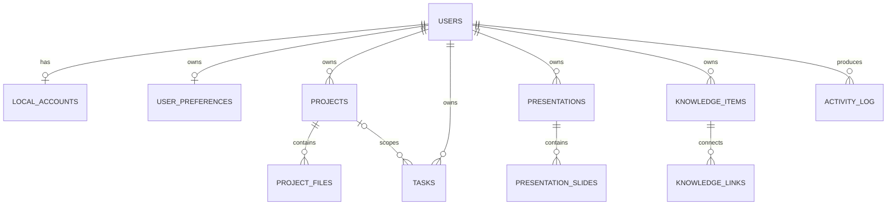
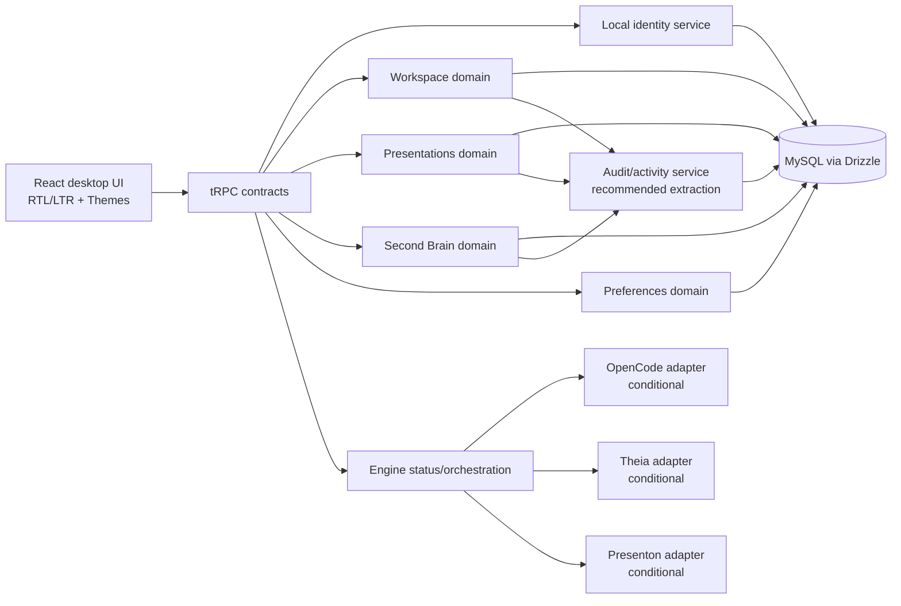
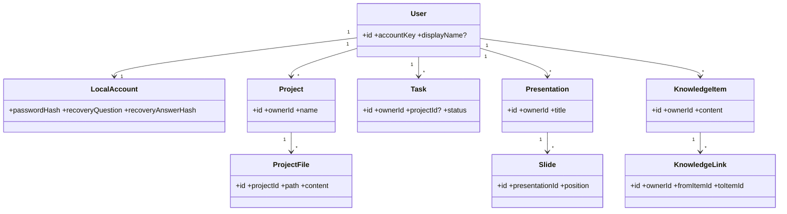

# التقرير الهندسي النهائي — Osamah IDE

**تاريخ المراجعة:** 26 أغسطس 2026
**نطاق الأدلة:** الوثيقتان المصدران المرفقتان، الكود المملوك للتطبيق، مخطط البيانات، عقود tRPC، الاختبارات وتقارير التغطية.
**حكم الصراحة:** يميز هذا التقرير بين ما هو **متحقق تشغيلياً**، وما هو **محدود أو غير مهيأ**، وما هو **توصية مستقبلية**. لا يحول وجود واجهة أو مصدر مورّد إلى ادعاء بأن التكامل يعمل.

## 1. منهج المراجعة والتتبعية

لم تتضمن المرفقات ترقيم صفحات ماديّاً؛ لذلك عومل كل ملف نصي كمصدر مستقل وبالترتيب الذي استُلم به. اكتمل تحليل المصدر الأول قبل قراءة الثاني، وسجّل النص المستخرج والعناوين والمتطلبات والأسئلة والتوصيات منفصلة لكل مصدر.

| التسلسل | المصدر | الغرض الذي خضع للتحليل | ناتج التتبّع |
|---:|---|---|---|
| 1 | `pasted_content_4.txt` | منهجية تحليل وثيقة مشروع صفحةً صفحة ومخرجات التقرير التنفيذي | [`SOURCE-PAGE-ANALYSIS-01.md`](./SOURCE-PAGE-ANALYSIS-01.md) |
| 2 | `pasted_content_5.txt` | مطلب توثيق backend بـJSDoc/TypeDoc قابل للقياس | [`SOURCE-PAGE-ANALYSIS-02.md`](./SOURCE-PAGE-ANALYSIS-02.md) |
| 3 | كود المشروع المملوك | الواقع المعماري والعقود والكيانات والحدود التشغيلية | [`ENGINEERING-INVENTORY.md`](./ENGINEERING-INVENTORY.md) |
| 4 | قياس التوثيق | اكتمال ترويسات وخدمات backend المملوكة | [`JSDOC-COVERAGE-MAP.md`](./JSDOC-COVERAGE-MAP.md) |

> **حد منهجي:** وثيقتا الإدخال تحددان عملية المراجعة ومعيار التوثيق، وليستا مواصفة منتج كاملة. ولذلك تفصل الأقسام التالية بين «المثبت من الكود» و«المطلوب لاتخاذ قرار منتج».

## 2. الملخص التنفيذي

Osamah IDE هو تطبيق ويب مكتبي عربي افتراضياً مبني على React وTypeScript وExpress وtRPC وDrizzle/MySQL. يقدّم حدوداً واقعية ومحمية للحساب المحلي، ومساحة البرمجة، والعروض، والعقل الثاني، والتفضيلات وسجل النشاط. تتحقق ملكية البيانات خادمياً في نطاقات CRUD الأساسية، وقد غطت الاختبارات الطرفية العزل بين حسابين في المشاريع والملفات والمهام والعروض والشرائح وعناصر وروابط المعرفة.

المشكلة الرئيسة ليست غياب الهيكل الخلفي، بل **التوقعات التشغيلية مقارنة بحالة التكاملات**. لا يوجد مزوّد أو نموذج OpenCode فعلي، ولا ناتج Theia browser مبني، ولا مزوّد توليد/تصدير لـPresenton. لذلك تبقى الدردشة التنفيذية، بيئة Theia، وتوليد العروض غير متاحة عمداً. وضع `?preview=ui` لا يعالج هذه الفجوة؛ فهو عرض مقيد بلا جلسة ولا بيانات ولا CRUD، وقد أضيف فقط لعرض البنية من الهاتف ثم أبلغ المستخدم أنه لا يحقق تجربة منتج حقيقية.

اكتمل توثيق JSDoc للواجهة العامة في backend المملوك وفق مقياس قابل لإعادة التشغيل: **23/23 ترويسة ملف و128/128 تصديراً عاماً موثقاً**. هذا مقياس موضع التعليق لا حكم ذاتي على جودة المحتوى. اجتازت بوابات الأنواع والاختبارات والتحقق الطرفي وحدود التكامل بعد التوثيق، كما ظل OmniRoute مستبعداً من مسارات التشغيل.

## 3. ما هو عامل فعلاً وما هو غير مهيأ

| المجال | الحالة المثبتة | الحد الصريح أو سبب عدم الإتاحة |
|---|---|---|
| الحساب المحلي والاسترداد | إنشاء/دخول/تسجيل خروج واسترداد بكلمة مرور وسؤال/جواب؛ كلمة المرور والإجابة بـscrypt والجلسة في Cookie HttpOnly | يحتاج تشديد معدل المحاولات وتدقيق إساءة الاستخدام قبل توسيع الاستخدام العام. |
| المشاريع والملفات والمهام | CRUD محمي وعزل ملكية وحفظ نشاط | محتوى الملفات النصي محفوظ في قاعدة البيانات؛ تحتاج أحجام واحتفاظ واضحين. |
| العروض والشرائح | CRUD محمي وترتيب شرائح مع عزل ملكية | Presenton صحي محلياً فقط؛ لا توليد ولا تصدير حقيقي بلا مزوّد مهيأ. |
| العقل الثاني | عناصر معرفة وروابط وبحث واستخراج مهام متاح ضمن الحدود الحالية | الخدمات الاختيارية لا تعمل تلقائياً ولا يوجد نموذج محلي أو fallback مخفي. |
| OpenCode | فحص تشغيل وحالة وسياق خادمي مملوك؛ الإرسال مقفل عند غياب نموذج | OpenCode أداة/بيئة وليس مزود نموذج. `modelCount=0`؛ لا محادثة تنفيذية بعد. |
| Eclipse Theia | المصدر والجسر والحالة موجودة | لم يبنَ browser artifact؛ لا تدّعى بيئة Theia عاملة. |
| واجهة سطح المكتب | تخطيط عمودي: تنقل جانبي، مساحة مركزية، ولوحة وكيل جانبية؛ العربية وRTL والمظهران موجودة | فحص النقر اليدوي على حساب حقيقي لم يكتمل في جلسة المستخدم. |
| وضع المعاينة | عرض آمن محدود بواسطة `?preview=ui` | لا بيانات/طلبات tRPC/CRUD أو إرسال وكيل؛ ليس تجاوز مصادقة ولا بديلاً عن الحساب. |

## 4. المتطلبات الوظيفية المستخلصة

### 4.1 متطلبات مثبتة في النظام

| المعرّف | المتطلب | الدليل أو عقد التنفيذ | معيار قبول قابل للاختبار |
|---|---|---|---|
| FR-01 | حساب محلي بلا إلزام اسم أو بريد عند التسجيل | `auth.local.register` و`localAccounts` | ينشأ الحساب بكلمة مرور وسؤال/جواب ومفتاح محطة غير سري. |
| FR-02 | استرداد كلمة المرور لا يتم قبل تحقق خادمي من الإجابة | `verifyRecoveryAnswer` ثم `resetPassword` | تفشل الإجابة الخاطئة ولا تظهر حالة تسمح بإعادة التعيين. |
| FR-03 | إدارة المشاريع والملفات والمهام | `workspace.*` | حساب ثانٍ لا يقرأ أو يكتب أو يحذف بيانات الحساب الأول. |
| FR-04 | إدارة العروض والشرائح | `presentations.*` | العرض والشرائح ملك للحساب؛ موضع الشريحة فريد داخل العرض. |
| FR-05 | إدارة المعرفة والروابط واستخراج المهام | `secondBrain.*` | الروابط لا تصل إلى عناصر حساب آخر، والاستخراج لا يدعي خدمة غير مهيأة. |
| FR-06 | حفظ تفضيلات اللغة والاتجاه والمظهر | `preferences.*` | تحفظ العربية/الإنجليزية وRTL/LTR والفاتح/الداكن خادمياً للمستخدم. |
| FR-07 | إعلان حالة المحركات وسياق وكيل مملوك | `engines.context` و`opencode.*` | لا يرسل العميل سياق ملكية موثوقاً؛ يبنى السياق على الخادم عند التنفيذ الحقيقي. |
| FR-08 | سجل نشاط مرتبط بالمالك | `activityLog` و`writeActivity` | ينشأ النشاط من عمليات المجال ولا يختلط بين الحسابات. |

### 4.2 متطلبات لا تزال قرارات منتج أو تنفيذ لاحق

| المعرّف | المتطلب المقترح | قرار مطلوب قبل التنفيذ |
|---|---|---|
| FR-P01 | تمكين محادثة OpenCode الفعلية | مزود/نموذج خادمي مصرح به، طريقة إدخال السر، نماذج مسموحة، وحصص/سجل تدقيق. |
| FR-P02 | تشغيل Theia في المتصفح | ميزانية بناء وذاكرة، ناتج browser قابل للنشر، وسياسة مساحة عمل الملفات. |
| FR-P03 | توليد وتصدير Presenton | مزود إنتاج مرئي/شرائح معتمد، مفاتيح خادمية، وسياسة تكلفة وملفات ناتجة. |
| FR-P04 | وصول مؤقت حقيقي من الهاتف | حساب اختبار منتهي الصلاحية أو دعوة آمنة؛ لا معاينة بلا بيانات بوصفها بديلاً. |
| FR-P05 | إدارة مرفقات/محتوى كبير | حدود الحجم، مسح أمني، تخزين كائنات، سياسة احتفاظ وحذف. |

## 5. المتطلبات غير الوظيفية والقيود

| المجال | المتطلب أو القيد | الحالة / الإجراء المقترح |
|---|---|---|
| الأمان | ملكية كل مورد تتحقق على الخادم، ولا تعطى للمتصفح سلطة على `ownerId` | مطبق في العقود المحمية؛ أضف اختبارات سلبية لكل مورد جديد. |
| سرية الجلسة | JWT داخل Cookie `HttpOnly`؛ لا تحفظ الأسرار في localStorage | مطبق؛ راجع سمات `Secure` و`SameSite` في بيئة الإنتاج. |
| خصوصية الموفر | مفاتيح نموذج OpenCode أو Presenton خادمية فقط | إلزامي؛ لا إضافة fallback محلي أو سحابي صامت. |
| الصراحة التشغيلية | الواجهة يجب أن تعطل وتشرح ميزة غير مهيأة | مطبق جزئياً؛ يجب إزالة أي عرض يوحي بأن المعاينة منتجات حقيقية. |
| تجربة سطح المكتب | الشريط الجانبي للتنقل ولوحة الوكيل عموديان، والمحتوى في المركز | مطلب تصميم ثابت؛ أي تعديل يعالج في لقطة سطح مكتب قبل الدمج. |
| التدويل | العربية افتراضية مع English وRTL/LTR ومظهرين | مطبق مع حفظ التفضيلات؛ يلزم اختبار يدوي كامل لحساب حقيقي. |
| الأداء والتوسع | لا تخزن محتوى غير محدود في صفوف قاعدة البيانات | أضف حدود إدخال وفهارس ومؤشرات مراقبة حجم. |
| القابلية للصيانة | توثيق واجهات backend القابلة للقياس | 100% للتصديرات العامة ضمن النطاق المقاس؛ فعّل حد CI بعد قرار الفريق. |

## 6. قواعد العمل وحالات الاستخدام

### 6.1 قواعد العمل

1. **BR-01:** لكل حساب محلي `accountKey` فريد وغير سري لربط محطة العميل، أما كلمة المرور وإجابة الاسترداد فمجزأتان ولا تعاملان كبيانات عرض.
2. **BR-02:** لا تعاد تهيئة كلمة المرور إلا بعد إثبات إجابة الاسترداد خادمياً في التدفق نفسه.
3. **BR-03:** كل مشروع وملف ومهمة وعرض وشريحة وعنصر معرفة ورابط مملوك لمستخدم، ويُرفض الوصول عبر معرف مورد يخص حساباً آخر.
4. **BR-04:** المسار فريد داخل المشروع، وموضع الشريحة فريد داخل العرض، والرابط فريد في نطاق مالكه ومصدريه.
5. **BR-05:** لا يصبح محرك ما «جاهزاً للتنفيذ» لمجرد العثور على مصدره؛ يلزم توفر ناتج/مزوّد/نموذج مناسب وفق كل محرك.
6. **BR-06:** لا يثق OpenCode بسياق يرسله المتصفح؛ يبني الخادم سياق مساحة العمل المملوك عند إجراء تنفيذ حقيقي.
7. **BR-07:** العرض المؤقت لا يحمل بيانات ولا يمنح صلاحيات ولا ينفذ طلبات كتابة؛ لا يستخدم بوصفه وضع تشغيل.

### 6.2 حالات الاستخدام ذات الأولوية

| حالة الاستخدام | الممثل | المسار الناجح | بدائل الإخفاق |
|---|---|---|---|
| UC-01 إنشاء حساب | مستخدم جديد | كلمة مرور + سؤال/جواب → حساب + جلسة | تكرار مفتاح المحطة أو فشل التحقق يعرض خطأ بلا تسريب. |
| UC-02 استرداد كلمة المرور | مستخدم محلي | طلب السؤال → إجابة صحيحة → تعيين كلمة مرور | إجابة خاطئة لا تفتح شاشة إعادة التعيين. |
| UC-03 إدارة مشروع | مستخدم مصادق | ينشئ مشروعاً ثم ملفات/مهام ويعدلها | معرف مشروع غير مملوك يرفض. |
| UC-04 إعداد عرض | مستخدم مصادق | ينشئ عرضاً وينظم شرائحه | التوليد معطّل ويبين سبب عدم التهيئة. |
| UC-05 تنظيم معرفة | مستخدم مصادق | ينشئ عناصر وروابط ويبحث أو يستخرج مهام | رابط إلى عنصر خارجي مملوك لغيره يرفض. |
| UC-06 إرسال وكيل | مستخدم مصادق مع مزوّد مهيأ | الخادم يجمع السياق المملوك ثم ينفذ | عند غياب نموذج يبقى الإرسال معطلاً وبشرح صريح. |

## 7. نموذج البيانات المقترح والمثبت

النموذج التالي يعكس الكيانات الموجودة، وليس توسعة تخمينية. يوصى بنقل المحتوى الكبير إلى تخزين كائنات عندما تتجاوز سياسة الحجم المتفق عليها.

| الكيان | المفتاح والعلاقات | توصية تحسين |
|---|---|---|
| `users` / `localAccounts` | مستخدم واحد وحساب محلي واحد؛ `accountKey` فريد | اختر مصدراً واحداً للبريد عند الحاجة لتفادي التكرار المستقبلي. |
| `projects` / `projectFiles` | مشروع مملوك، ملفات ذات مسار فريد داخله | تحقق من أن `parentId` ينتمي إلى المشروع نفسه؛ ضع سقفاً للحجم والنوع. |
| `tasks` / `activityLog` | مملوكان للمستخدم؛ المهمة قد ترتبط بمشروع | افصل كتابة النشاط إلى خدمة نطاق محايدة. |
| `presentations` / `presentationSlides` | شرائح مرتبة وفريدة الموضع داخل العرض | استخدم معاملة ترتيب عند نقل عدة شرائح مستقبلاً. |
| `knowledgeItems` / `knowledgeLinks` | عناصر وروابط مملوكة | تحقق من الملكية لكلا طرفي الرابط داخل المعاملة. |

## 8. التصميم المعماري المقترح

### 8.1 الطبقات والخدمات

### 8.2 Class/Domain diagram

### 8.3 واجهات API المطلوبة

توجد العقود حالياً على tRPC؛ لا يلزم إدخال REST موازٍ. عند الحاجة لتكامل خارجي، ينشأ محول خادمي محدد لا طلب متصفح مباشر.

| النطاق | إجراءات مطلوبة | حماية | ملاحظة |
|---|---|---|---|
| الهوية | register, login, logout, recoveryQuestion, verifyRecoveryAnswer, resetPassword, updateProfile | عامة وفق تدفق تحقق مقيد | أضف rate limiting وحدث تدقيق أمني. |
| المساحة | project/file/task/activity CRUD | `protectedProcedure` | يجب أن تفرض خدمة الوصول الملكية قبل أي عملية. |
| العروض | presentation/slide CRUD وترتيب | `protectedProcedure` | التوليد والتصدير API منفصلان فقط بعد التهيئة. |
| العقل الثاني | item/link CRUD، search، extraction، task migration | `protectedProcedure` | أي مزوّد خارجي يعلن حالة readiness منفصلة. |
| المحركات | status, context، جلسات تنفيذ مشروطة | محمي للتنفيذ والسياق | لا قبول نموذج افتراضي ولا أسرار عميل. |
| تفضيلات | get, update | `protectedProcedure` | whitelist للحقول والقيم المقبولة. |

## 9. الثغرات والمخاطر والقرارات المطلوبة

| المعرف | الخطر أو الفجوة | الأثر | الأولوية | الإجراء الموصى به |
|---|---|---|---|---|
| R-01 | التسجيل وتحقق الاسترداد لا يظهر فيهما حد معدل محاولات على مستوى العقد | تخمين كلمة المرور/الإجابة وإرهاق الخدمة | P0 | حد بحسب IP و`accountKey`، تأخير متزايد، مراقبة وبدون كشف سبب التفصيل. |
| R-02 | `workspace/db.ts` يخلط CRUD والملكية والنشاط | صعوبة الصيانة والاختبار واقتران نطاقات | P1 | استخراج `activity` و`ownership` إلى خدمات صريحة مع اختبارات عقود. |
| R-03 | العروض والعقل الثاني يعتمدان على `writeActivity` من مساحة العمل | اقتران بين bounded contexts | P1 | خدمة نشاط مستقلة أو واجهة نطاقية مشتركة. |
| R-04 | محتوى كبير في قاعدة البيانات بلا سياسة حجم منشورة | تضخم DB ونسخ احتياطي بطيء | P1 | حدود إدخال، تخزين كائنات للمرفقات، مؤشرات حجم واحتفاظ. |
| R-05 | OpenCode بلا مزود/نموذج | تجربة وكيل غير قابلة للتنفيذ | P0 قرار منتج | لا تفعّل UI؛ حدد موفراً ونموذجاً وسياسة صلاحيات قبل التنفيذ. |
| R-06 | Theia بلا ناتج browser | قسم برمجة متوقع لكنه غير قابل للتشغيل | P1 قرار تشغيلي | دراسة حجم البناء/الذاكرة أو تكامل مخصص محدود بدلاً من ادعاء IDE كامل. |
| R-07 | Presenton بلا توليد/تصدير | عرض إعداد وليس مولداً فعلياً | P1 قرار منتج | إعداد مزود وتكاليف وقياس قبل تفعيل الأزرار. |
| R-08 | المعاينة المقيدة لا تلبي تجربة استعمال من الهاتف | انطباع «كل شيء غير متاح» وتناقض UX | P0 | أزلها من مسار المستخدم أو قدم حساب تجريبي منتهي الصلاحية بصلاحيات واضحة. |
| R-09 | تكرار البريد في جدولين | تعارض بيانات مستقبلي | P2 | توحيد المصدر أو فرض مزامنة ضمن معاملة واحدة. |
| R-10 | نقطة استعادة WebDev محجوبة بوسائط الموردين الكبيرة | صعوبة نشر/استعادة | P1 | قرار صريح لنقل/استبعاد الوسائط دون تعديل snapshots قبل الموافقة. |

## 10. Backlog وخارطة طريق التنفيذ

### 10.1 Backlog مرتب

| الأولوية | العنصر | معايير القبول | الاعتماديات |
|---|---|---|---|
| P0 | إيقاف تقديم المعاينة المقيدة كحل وصول | الرابط لا يكون CTA رئيسياً؛ رسالة واضحة عن حدوده؛ مسار الحساب يبقى الأساس | قرار المنتج. |
| P0 | حواجز rate-limit للاسترداد والدخول | اختبار يثبت الحظر المؤقت وتسجيله بلا كشف بيانات | مخزن عدادات أو middleware. |
| P0 | قرار مزود OpenCode | سر خادمي، نموذج محدد، اختبار رسالة حقيقية، إذن سياق | موافقة المستخدم على المزوّد. |
| P1 | استخراج خدمة النشاط والملكية | لا استيراد نطاق العمل لخدمة النشاط من نطاقات أخرى؛ اختبارات خضراء | تصميم واجهة خدمة. |
| P1 | سياسة المحتوى والحجم | حدود موثقة ومطبقة؛ نقل المرفقات إلى تخزين كائنات عند اللزوم | سياسة منتج/تخزين. |
| P1 | قرار Theia | دليل بناء/نشر أو إغلاق صريح للنطاق | موارد بناء وتشغيل. |
| P1 | تفعيل Presenton بعد التهيئة | health + generate + export حقيقيان ومختبران | مزوّد ومفاتيح وتكلفة. |
| P2 | توحيد البريد | ترحيل قابل للعكس واختبارات تعديل ملف الحساب | موافقة على مصدر الحقيقة. |
| P2 | حاجز CI لتوثيق JSDoc | يفشل PR عند تراجع حد متفق عليه | قرار الفريق بشأن الحد والاستثناءات. |
| P2 | فصل `OsamahWorkspace` إلى وحدات عرض | لا تغيير بصري على سطح المكتب؛ لقطات مقارنة وتغطية تفاعل | تصميم مكونات. |

### 10.2 خارطة الطريق

| المرحلة | المدة الاسترشادية | المخرجات | بوابة الخروج |
|---|---:|---|---|
| 0 — قرارات المنتج | 1 أسبوع | مزود OpenCode، مصير المعاينة، سياسة محتوى/تخزين، مسؤول Theia/Presenton | قرارات مكتوبة وملاك مخاطر. |
| 1 — أمان وهوية | 1–2 أسبوع | rate limiting، سجلات أمنية، اختبارات إساءة استخدام | اختبارات سلبية وقياسات مراقبة. |
| 2 — فصل النطاقات | 2–3 أسابيع | `activity` و`ownership` كخدمات مستقلة، معالجة تكرار البريد | مراجعة معمارية وE2E. |
| 3 — تكامل واحد مُعتمد | 2–4 أسابيع لكل تكامل | OpenCode أو Presenton أو Theia وفق القرار | تشغيل حقيقي بلا fallback وقياس فشل. |
| 4 — صلابة UX ونشر | 1–2 أسبوع | اختبار يدوي RTL/المظهرين/سطح المكتب، CI، معالجة حاجز الوسائط | قبول منتج ونقطة استعادة قابلة للحفظ. |

### 10.3 تقدير الجهد والزمن والتكلفة

التقدير التالي **استرشادي للتخطيط وليس عرض سعر أو التزاماً تجارياً**. يفترض فريقاً صغيراً من 2–3 مهندسين، 40 ساعة للشخص-أسبوع، وعدم ظهور تعقيد إضافي في بناء Theia أو ترخيص/تكلفة مزود النموذج.

| السيناريو | الجهد | الزمن التقويمي التقريبي | تكلفة ساعات تطوير تقريبية |
|---|---:|---:|---:|
| حد أدنى آمن: الهوية، فصل النشاط، UX، CI، بلا تكامل IDE كامل | 27 شخص-أسبوع | 9–14 أسبوعاً | 27,000–81,000 دولار عند 25–75 دولار/ساعة |
| نطاق موسع: ما سبق + تكامل واحد حقيقي + تحضير Theia/Presenton | 48 شخص-أسبوع | 16–24 أسبوعاً | 48,000–144,000 دولار عند 25–75 دولار/ساعة |

لا تشمل الأرقام رسوم مزود النماذج، استهلاك توليد العروض، استضافة خاصة، تدقيقاً أمنياً مستقلاً، أو كلفة إعادة بناء Theia إذا تجاوزت حدود الموارد الحالية.

## 11. تقييم جودة وثيقتي الإدخال

**النتيجة: 62/100** عند تقييمهما معاً كموجّه هندسي، لا كمواصفة منتج مكتملة.

| المحور | النقاط | التبرير |
|---|---:|---|
| الوضوح والتنظيم | 18/20 | المنهجية ومخرجات الصفحة وتسلسل العمل محددة بوضوح جيد. |
| اكتمال المتطلبات | 4/20 | لا توجد حالات استخدام للمنتج أو شخصيات أو نطاق بيانات أو قبول وظيفي تفصيلي. |
| الاتساق | 17/20 | الفصل صفحةً صفحة متسق؛ توجد حاجة لتعريف «الصفحة» عند كون المصدر نصاً غير مرقم. |
| القابلية للتحقق | 14/20 | يطلب التحليل والأسئلة، لكن لا يحدد بوابات قبول رقمية أو مالكاً للتوقيع. |
| القابلية للتنفيذ | 9/20 | مناسب لتوجيه تدقيق وتوثيق، لكنه لا يحسم قرارات مزود النموذج/التشغيل/البيانات. |

لرفع الجودة إلى 85/100 أو أكثر، ينبغي إضافة نطاق منتج واضح، أصحاب المصلحة، حالات استخدام مقبولة، متطلبات أداء/أمن قابلة للقياس، مصفوفة تتبع، موازنات تكامل، ومعايير قبول موقعة لكل مرحلة.

## 12. أسئلة القرار المتبقية

1. ما مزود النموذج والنماذج المسموح بها لـOpenCode، ومن يوافق على التكلفة ومفاتيح الخادم؟
2. هل Theia مطلب منتج ملزم أم يمكن اعتماد محرر أخف إلى حين تخصيص موارد بناء وتشغيله؟
3. هل Presenton مطلوب للتوليد والتصدير الآن، وما المزود/السقف المالي/سياسة الملفات؟
4. هل تريد حساباً تجريبياً منتهي الصلاحية أم أن الوصول من الهاتف يجب أن يبقى خلف الحساب المحلي فقط؟
5. ما أقصى حجم للملف والملاحظة والشريحة، وما فترة الاحتفاظ وما متطلبات الحذف؟
6. هل البريد مصدر تعريف اختياري أم يجب إزالته من الحساب المحلي تماماً لتجنب التكرار؟
7. هل توافق على نقل أو استثناء وسائط الموردين الكبيرة وفق سياسة موثقة حتى تصبح نقطة الاستعادة والنشر متاحة؟
8. ما حد JSDoc الذي يجب أن يحجب الدمج في CI: 100% للتصديرات الجديدة، أم حد تدريجي؟

## 13. الأدلة والمراجع

- نتائج التدقيق والاختبارات والحدود: [`AUDIT-RESULTS.md`](./AUDIT-RESULTS.md).
- جرد البنية والكيانات والمخاطر: [`ENGINEERING-INVENTORY.md`](./ENGINEERING-INVENTORY.md).
- تحليل الوثيقتين بالتسلسل: [`SOURCE-PAGE-ANALYSIS-01.md`](./SOURCE-PAGE-ANALYSIS-01.md) و[`SOURCE-PAGE-ANALYSIS-02.md`](./SOURCE-PAGE-ANALYSIS-02.md).
- قياس JSDoc: [`JSDOC-COVERAGE-MAP.md`](./JSDOC-COVERAGE-MAP.md) و`pnpm audit:jsdoc`.
- معايير تعليقات TypeScript/JSDoc: [TypeDoc Doc Comments](https://typedoc.org/documents/Doc_Comments.html) و[JSDoc](https://jsdoc.app/).
